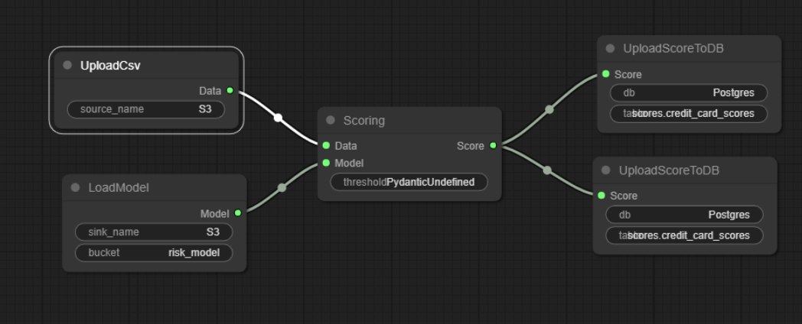
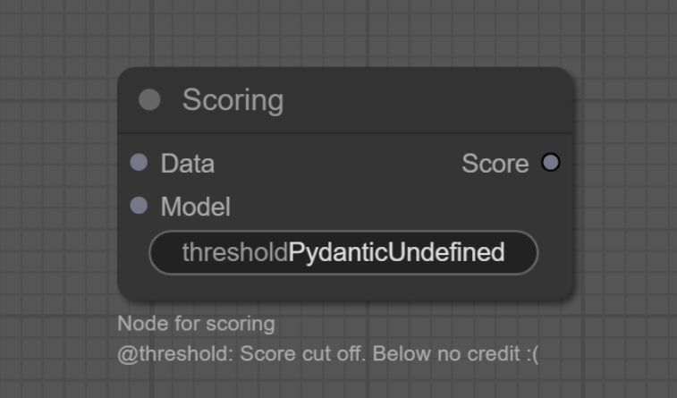

# PydanticGraph
Organizing [Pydantic](https://github.com/jagenjo/litegraph.js/tree/master) models into graph with [Litegraph](https://github.com/jagenjo/litegraph.js/tree/master) interface.



Demo via (link)[nmashalov.github.io/Pydantic_litegraph/]

## Quick start

```bash
poetry shell # creates virtual environment for project
poetry install # install all dependencies
python server.py # load example 
```

You can add your own model by just simple dropping of `.py` file with models.

### Functionality
- flexible organization of nodes defined via pydantic models
- transform LiteGraph linkage to Gitlab style aka `depends_on`

### Features
- Use buttons `validate` and `download` for checking your workflow
- New nodes can be added via dropping `.py` file to canvas.
- Docstring and Pydantic fields description forms hint 


## Adding custom model


For defining models you need only pydantic.

```python
from pydantic import BaseModel, Field
from typing import ClassVar

class Scoring(BaseModel):
    # inputs and outputs should be written in uppercase 
    # And have type ClassVars
    INPUTS : ClassVar = [
        ('Data','.csv'),
        ('Model','.pkl'),
    ]
    # first element in tuple names field in UI
    # second defines type
    # note that type should be equal to connect node
    OUTPUTS : ClassVar = [
        ('Score','csv',)
    ]
    # all fields will be visualized as widgets
    # for fast modification
    # You can easily add comment to field by
    # description argument in field 
    threshold: int = Field(description='Score cut off. Below no credit :(')   
```

Upload can be performed in several convenient way.
- explicably 


## Configurate yaml of Graph 
Can be configured with [`graph.conf.yaml`](graph.conf.yaml).

## Modifications

Under the hood of module is client-server with FastApi. This helps to couple Javascript and Python.  

All modifications can be performed as simple as 

## References
- [Litegraph](https://github.com/jagenjo/litegraph.js/tree/master)
- [Pydantic](https://github.com/jagenjo/litegraph.js/tree/master)
