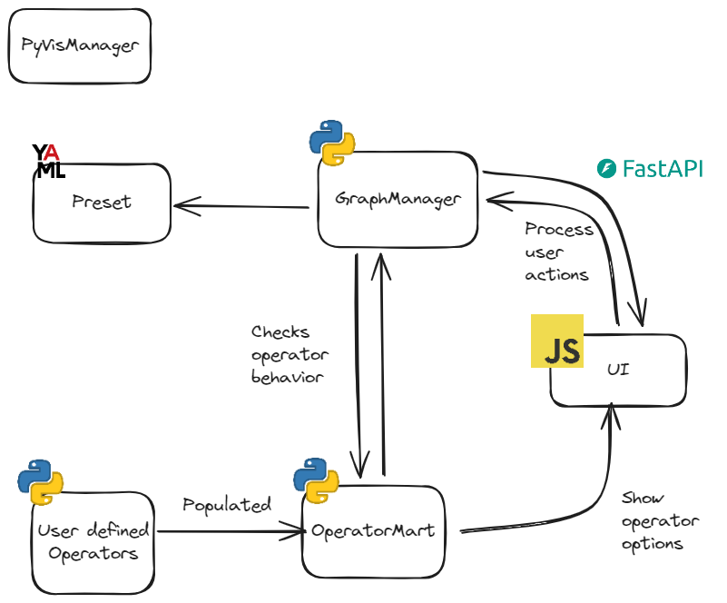
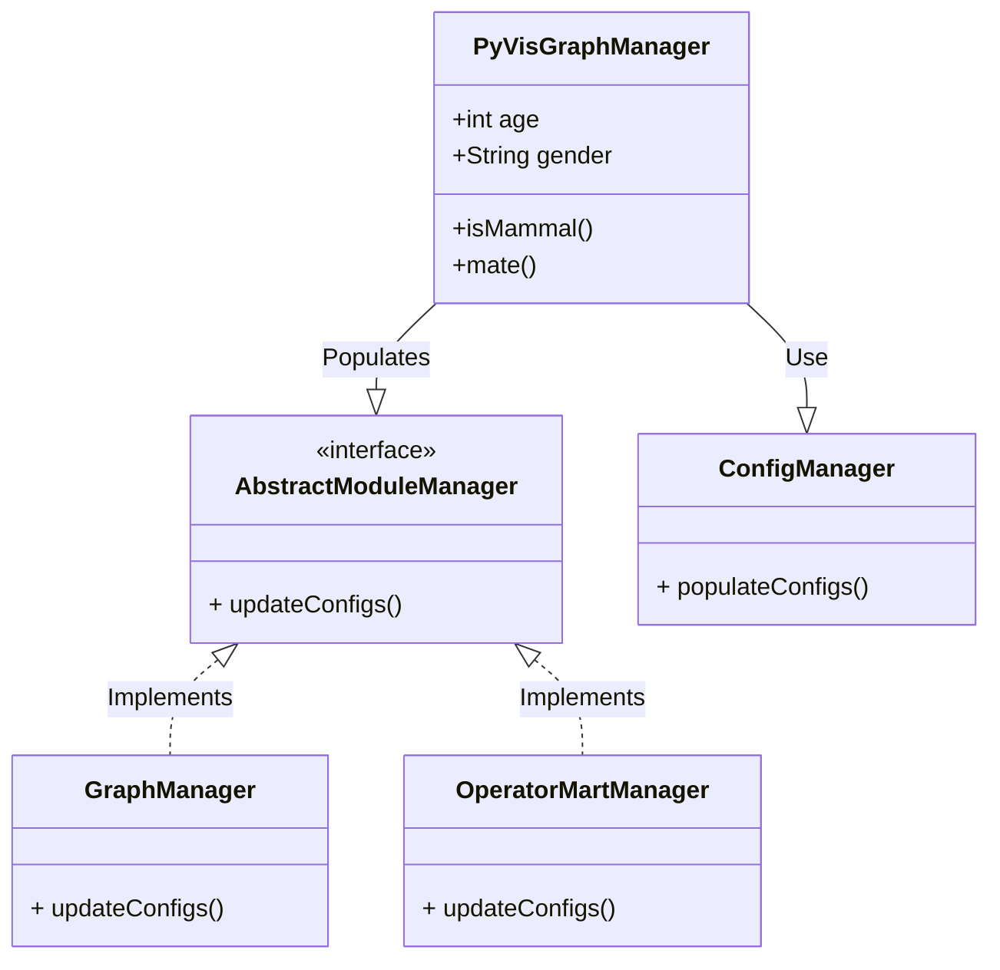

## Architecture

OperatorMart collects data from user

Every module has it's own manager, which are responsible for providing configs and 

```mermaid
classDiagram
    AbstractModuleManager <|.. GraphManager: Implements
    AbstractModuleManager <|.. OperatorMartManager: Implements
    PyVisGraphManager --|> AbstractModuleManager: Populates
    PyVisGraphManager --|> ConfigManager: Use
    class AbstractModuleManager{
        <<interface>>
        + updateConfigs()
    }
    class ConfigManager{
        + populateConfigs()
    }
    class PyVisGraphManager{
        +int age
        +String gender
        +isMammal()
        +mate()
    }
    class GraphManager {
        + updateConfigs()
    }
    class OperatorMartManager{
        + updateConfigs()
    }
```
