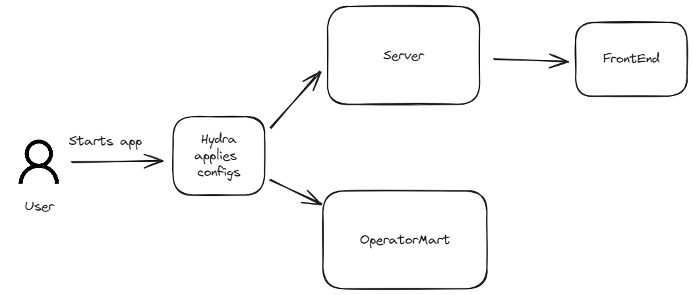
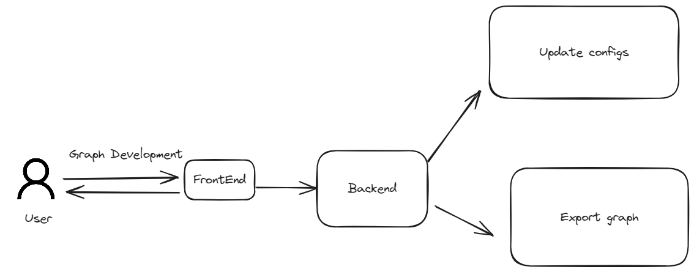

Frontend:
- linkage: same type restrictions  
- 
Backend is responsible for:
- dynamically changing configurations 
- formatting graph representation in desired format
- api for 
- processing frontend 


## Timeline


1. Init
    User run app, that provides configuration for backend and it's downstream apps.

    

    User can overwrite configuration  using hydra syntax 

    ```bash
    pyvisgraph --output.format='json'
    ```
2. Run
    Then user interact with app creating his 
    
    He is capable of changing app configs


Guide on re


# Design
I 

## Registration
Model registration is done via representation of operator.

Representation grabs signature of model
- class name
- __init__ arguments and it's types
- INPUT and OUTPUT vars for connectivity

Note that pyvisgraph only parses tool. It can not redact code.

## Graph manipulations

Graph linkage is done on frontend. M
Backend receives current status on 

##

```python

```

Operator manipulation is restricted in UI as app doesn't provide service for 


Orchestration of operators:
- deduplication of operators
- view 