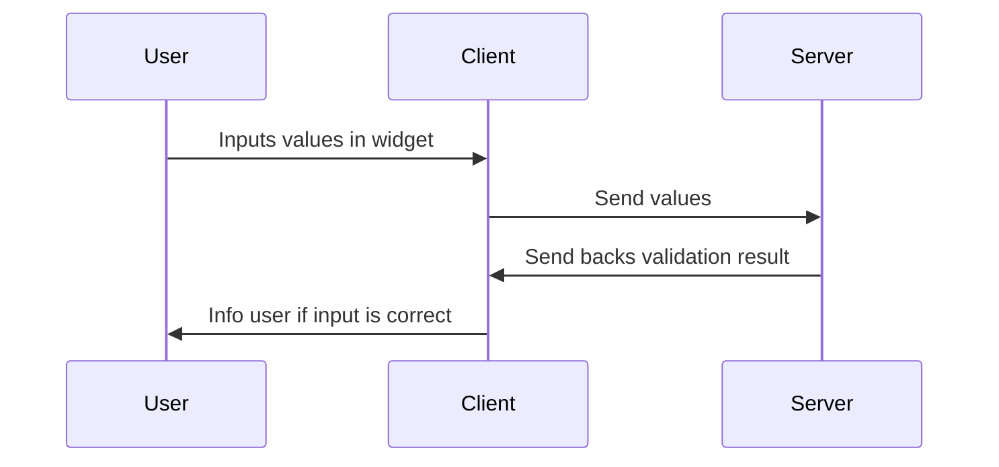

Validation is performed via client-sever interloquence




```js

callback = (update) => {
    fetch(
        "127.0.0.1", {
        method: "POST",
        body: JSON.stringify({
            update
        }),
        headers: {
            "Content-type": "application/json; charset=UTF-8"
        }
        }
    )
    .then((response) => response.json())
    .then((json) => console.log(json))
};

function MyNode(){
    
    this.addWidget("combo","Combo", "red", callback, { values:["red","green","blue"]} );
} 
```