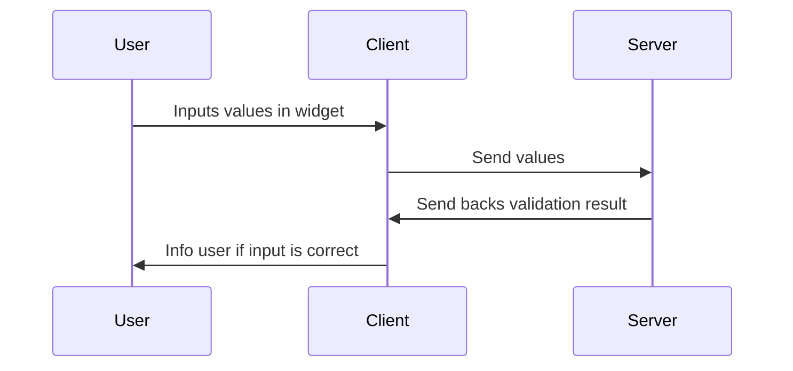

Validation is performed via client-sever interloquence

```mermaid
sequenceDiagram
    User->>Client: Inputs values in widget
    Client->> Server: Send values  
    Server->>Client: Send backs validation result
    Client->>User: Info user if input is correct
```
